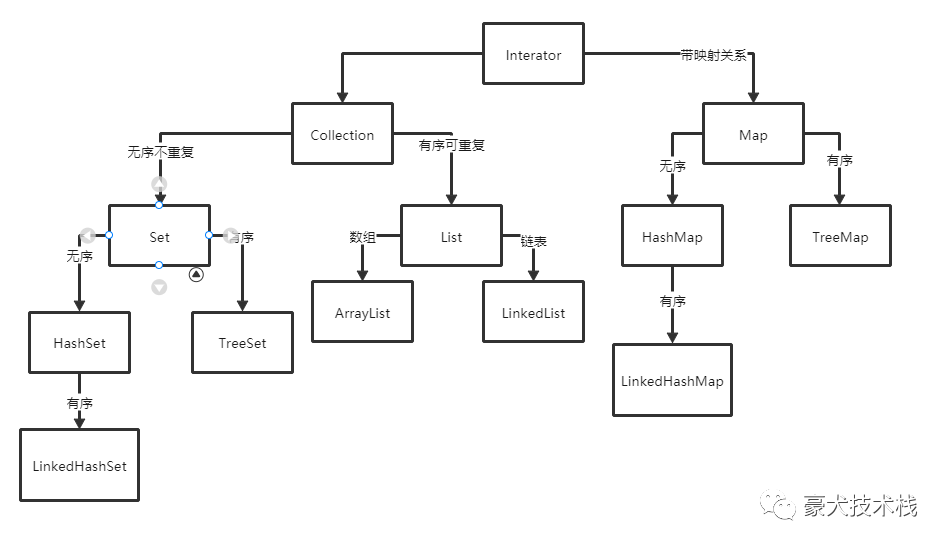

## ArrayList和LinkedList

集合关系图如下：



ArrayList和LinkedList，其实就是数组与链表的区别


鉴于两者的数据结构，**数组适合查找，链表更适合修改**，是不是数组不适合应用于增加呢？不是的，当不指定位置时，ArrayList默认是添加到末尾，这时时间复杂度跟LinkedList是相同的，比如：

```java
public class Test {
    
    static final int N=50000;
    
    static long timeList(List list){
        long start=System.currentTimeMillis();
        Object o = new Object();
        for(int i=0;i<N;i++)
            list.add(0); //在末尾添加
        return System.currentTimeMillis()-start;
    }
    
    public static void main(String[] args) {
        System.out.println("ArrayList耗时："+timeList(new ArrayList()));
        System.out.println("LinkedList耗时："+timeList(new LinkedList()));
    }
}

结果：
ArrayList耗时：4
LinkedList耗时：3
```


可见此时两者是一样的，那如果是指定位置，那数组意味着会有数据移动和复制上的开销，验证如下：

```java
public class Test {

    static final int N=50000;

    static long timeList(List list){
        long start=System.currentTimeMillis();
        Object o = new Object();
        for(int i=0;i<N;i++)
            list.add(0,0);  //在头部添加
        return System.currentTimeMillis()-start;
    }

    public static void main(String[] args) {
        System.out.println("ArrayList耗时："+timeList(new ArrayList()));
        System.out.println("LinkedList耗时："+timeList(new LinkedList()));
    }
}

结果：
ArrayList耗时：301
LinkedList耗时：3
```


可见LinkedList变化不大，不管是在头部还是尾部添加；相反的，数组这种情况下就耗时变大了。

**所以插入更推荐使用LinkedList。**


至于查询，可以通过数据简单比对一下，在10000000个数中进行测试

```java

public class Test {

    static final int N=10000000;

    static long timeList(List list){

        Object o = new Object();
        for(int i=0;i<N;i++) {
            list.add(1);
        }
        long start=System.currentTimeMillis();
        //list.get(0);//头部
        list.get(5000000);//中部
        //list.get(9999999);//尾部
        return System.currentTimeMillis()-start;
    }

    public static void main(String[] args) {
        //System.out.println("ArrayList耗时："+timeList(new ArrayList()));
        System.out.println("LinkedList耗时："+timeList(new LinkedList()));
    }
}
```


|                | **头部** | **中间** | **尾部** |
| -------------- | ------ | ------ | ------ |
| **ArrayList**  | 0      | 0      | 0      |
| **LinkedList** | 0      | 13     | 0      |


为什么LinkedList只有在查询中间的时候才会耗时过长？从源码中我们可以找到答案

```java
public E get(int index) {
        checkElementIndex(index);
        return node(index).item;
 }

Node<E> node(int index) {
        // assert isElementIndex(index);

        if (index < (size >> 1)) {
            Node<E> x = first;
            for (int i = 0; i < index; i++)
                x = x.next;
            return x;
        } else {
            Node<E> x = last;
            for (int i = size - 1; i > index; i--)
                x = x.prev;
            return x;
        }
}

```


若查询第n条数据时：
n<(a/2)时 从前往后查询
n>(a/2)时 从后往前查询

随着n越大，查询时间越长；而ArrayList在查询都很稳定。


**所以查询推荐使用ArrayList。**