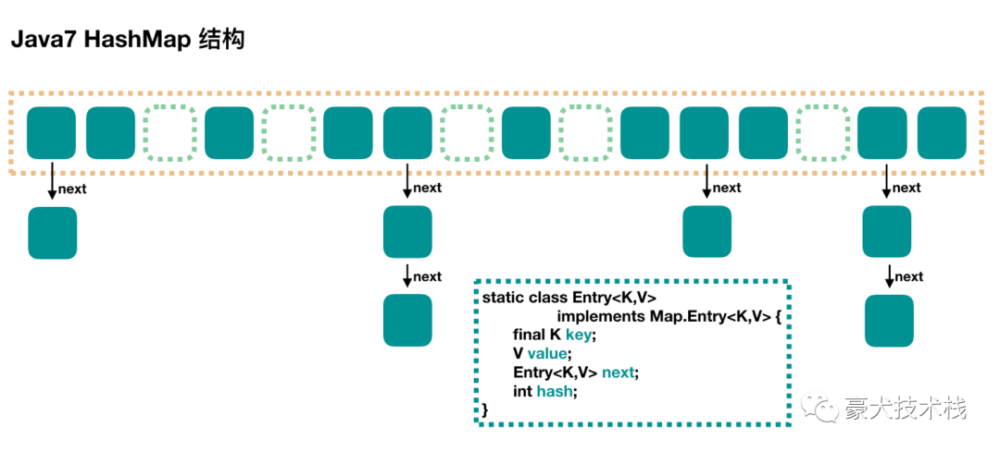
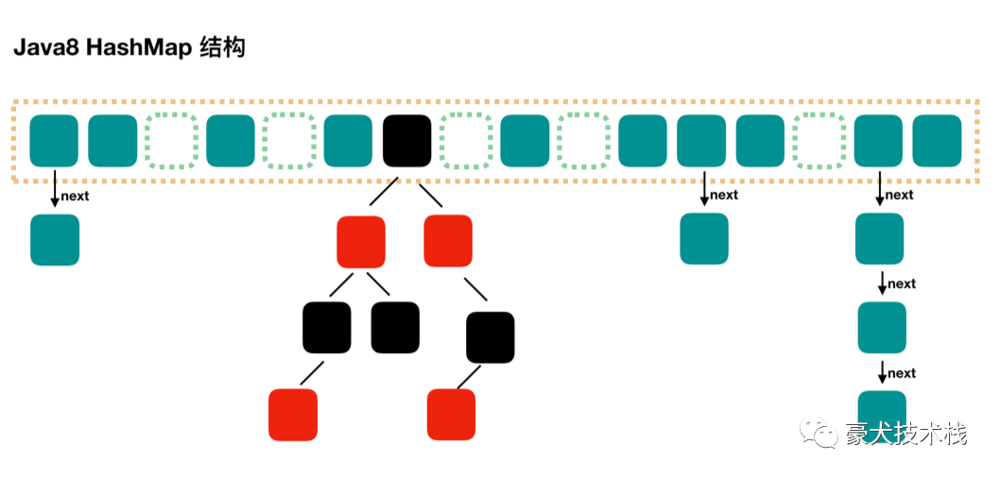
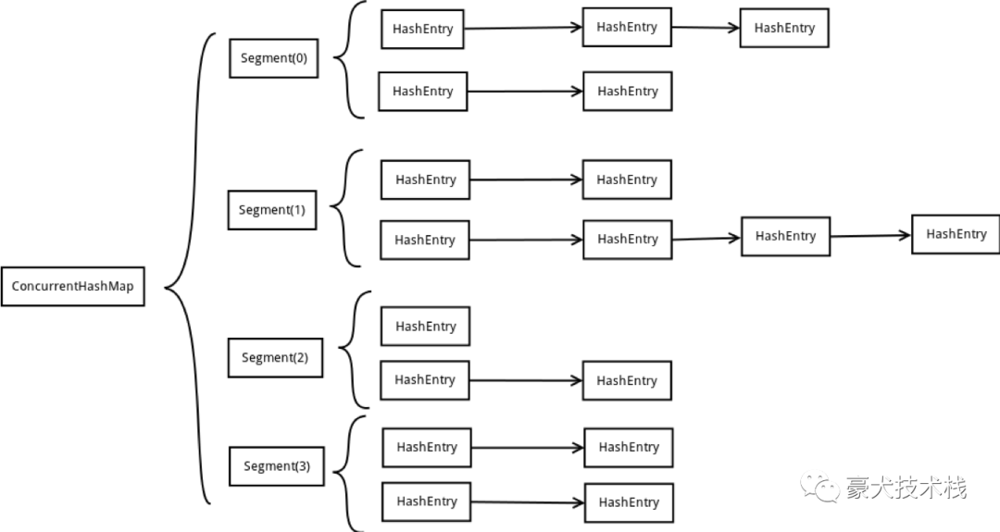

## ConcurrentHashMap加锁力度

ConcurrentHashMap就是HashMap的线程安全版

HashMap的线程安全问题是多个线程同时操作，在【哈希碰撞】的情况下发生的。


**哈希碰撞**

即当两个key hash之后槽位值相同，就会以链表的形式存在，这个过程叫【哈希碰撞】。

在jdk1.8之前，发生【哈希碰撞】后会以链表的形式存在，但是会存在一种极端的情况就是，所有的key hash值相同，就会是一大串的链表，HashMap将失去其意义，而链表并不适合查询。


JDK1.7是用单链表进行的纵向延伸，当采用头插法时会容易出现逆序且环形链表死循环问题。但是在JDK1.8之后是因为加入了红黑树使用尾插法，能够避免出现逆序且链表死循环的问题。这死循环探讨并没有什么意义，因为是使用HashMap做并发的时候才会发生，而官方并不建议使用HashMap做并发，推荐使用ConcurrentHashMap。





在jdk1.8之后，做了改进，就是当链表的阈值大于等于TREEIFY_THRESHOLD之后（默认值是8），就会调用treeifyBin方法由将链表转化成红黑树，即时间复杂度由 O(n)——>O(logn)。



那为什么是8？

8=2^3，这样链表调整成往往会是3阶的红黑树；而8个以下的链表查询性能跟对应的红黑树查询性能比较起来相差无几，但比起链表，红黑树的空间占用却增加了，在这种情况下做转化，反而会影响性能。


线程安全问题知道了，接下来了解是怎么做线程安全的？就是通过ConcurrentHashMap。


**ConcurrentHashMap**

在jdk1.8之前，ConcurrentHashMap是采用数组+Segment+分段锁的方式实现



这种方式定位一个元素的过程需要进行两次Hash操作。第一次Hash定位到Segment，第二次Hash定位到元素所在的链表的头部。

#### 

该结构坏处是这一种结构的带来的副作用是Hash的过程要比普通的HashMap要长。


在jdk1.8之后，ConcurrentHashMap参考了JDK1.8 HashMap的实现，采用了数组+链表+红黑树的实现方式来设计，采用CAS+synchronized操作（第10行和第18行代码）。将加锁力度细化到了最小的Node上，即每一个槽位。并发性能也得到优化。

```java
final V putVal(K key, V value, boolean onlyIfAbsent) {
        if (key == null || value == null) throw new NullPointerException();
        int hash = spread(key.hashCode());
        int binCount = 0;
        for (Node<K,V>[] tab = table;;) {
            Node<K,V> f; int n, i, fh;
            if (tab == null || (n = tab.length) == 0)
                tab = initTable();
            else if ((f = tabAt(tab, i = (n - 1) & hash)) == null) {
                if (casTabAt(tab, i, null,
                             new Node<K,V>(hash, key, value, null)))
                    break;                   // no lock when adding to empty bin
            }
            else if ((fh = f.hash) == MOVED)
                tab = helpTransfer(tab, f);
            else {
                V oldVal = null;
                synchronized (f) {
                    if (tabAt(tab, i) == f) {
                        if (fh >= 0) {
                            binCount = 1;
                            for (Node<K,V> e = f;; ++binCount) {
                                K ek;
                                if (e.hash == hash &&
                                    ((ek = e.key) == key ||
                                     (ek != null && key.equals(ek)))) {
                                    oldVal = e.val;
                                    if (!onlyIfAbsent)
                                        e.val = value;
                                    break;
                                }
                                Node<K,V> pred = e;
                                if ((e = e.next) == null) {
                                    pred.next = new Node<K,V>(hash, key,
                                                              value, null);
                                    break;
                                }
                            }
                        }
                        else if (f instanceof TreeBin) {
                            Node<K,V> p;
                            binCount = 2;
                            if ((p = ((TreeBin<K,V>)f).putTreeVal(hash, key,
                                                           value)) != null) {
                                oldVal = p.val;
                                if (!onlyIfAbsent)
                                    p.val = value;
                            }
                        }
                    }
                }
                if (binCount != 0) {
                    if (binCount >= TREEIFY_THRESHOLD)
                        treeifyBin(tab, i);
                    if (oldVal != null)
                        return oldVal;
                    break;
                }
            }
        }
        addCount(1L, binCount);
        return null;
    }
```

