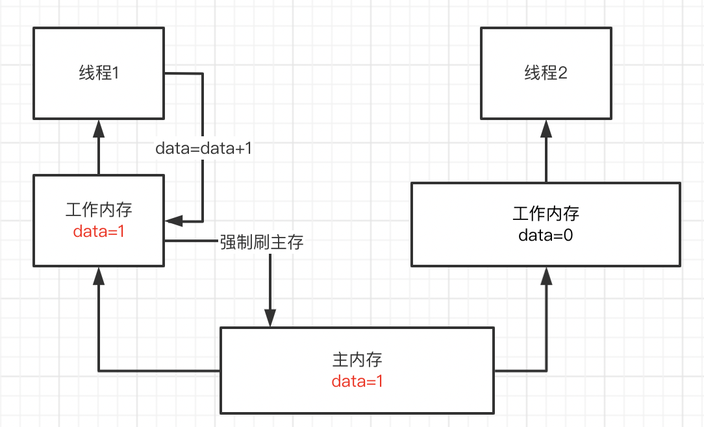
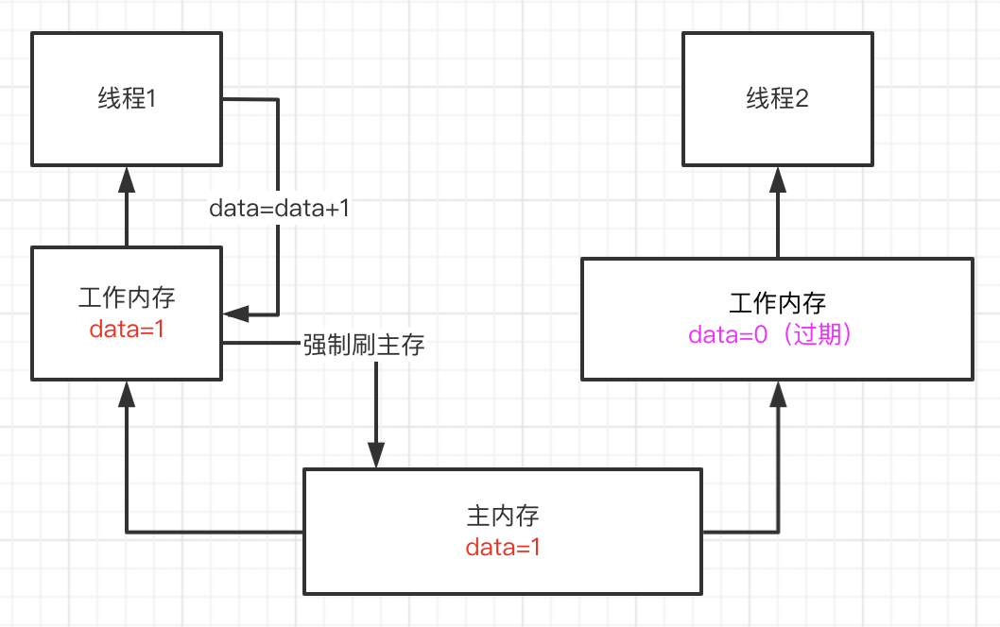
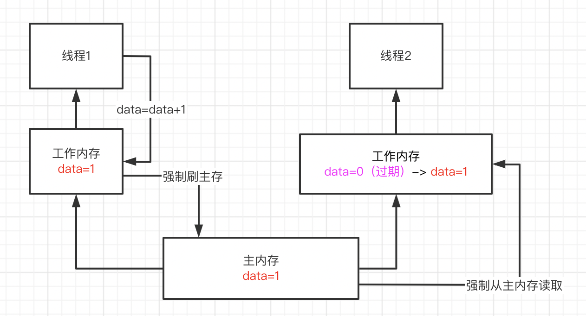
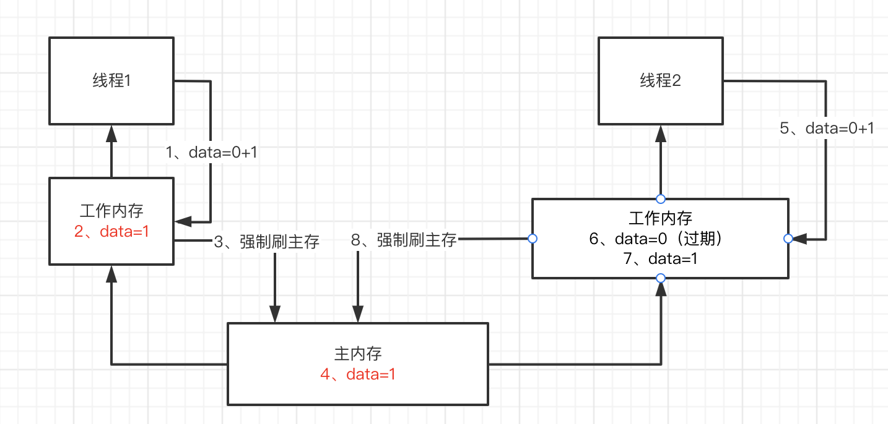

## Volatile关键字

线程所读取的变量是处于内存当中的，而做变量的写操作，会把内存当中的数据发送到CPU的一个指令寄存器上，在指令寄存器上去做写，写完之后再同步回对应的一个内存当中，每个线程读取变量的一个栈地址是不同的，因此每个线程看到的一个内存区域往往是属于自己栈空间内的一个副本，那就没有办法在多线程环境下，一个写操作，立马就同步到另一个线程可见的状态。因此，多线程变量的修改是需要加volatile关键字的，同时volatile关键字也可以防止指令重排，确保我们读操作在代码维度必定发生在写操作之后，去做流程的控制。

### volatile的实现原理

1、一旦data变量定义的时候前面加了volatile来修饰的话，那么线程1只要修改data变量的值，就会在修改完自己本地工作内存的data变量值之后，强制将这个data变量最新的值刷回主内存。<u>必须让主内存里的data变量值立马变成最新的值</u>！

2、如果此时别的线程的工作内存中有这个data变量的本地缓存，也就是一个变量副本的话，那么会强制让其他线程的工作内存中的data变量缓存直接失效过期，不允许再次读取和使用了！

3、如果线程2在代码运行过程中再次需要读取data变量的值，此时尝试从本地工作内存中读取，就会发现这个data = 0已经过期了！

此时，他就必须重新从主内存中加载data变量最新的值！那么不就可以读取到data = 1这个最新的值了！

volatile主要解决的是一个线程修改变量值之后，其他线程立马可以读到最新的值，是解决这个问题的，也就是可见性。不然线程1和线程2其实都是在操作一个变量data，但是线程1修改了data变量的值之后，线程2看不到，一直都是看到自己本地工作内存中的一个旧的副本的值！

但是如果是多个线程同时修改一个变量的值，那还是可能出现多线程并发的安全问题，导致数据值修改错乱，volatile是不负责解决这个问题的，也就是不负责解决原子性问题。

**强制让其他线程的工作内存中的data变量缓存直接失效过期，还保证不了原子性吗？**

是的，假设在失效前线程2就做 data=0+1的操作，虽然线程2的工作内存里的变量失效了，但是线程2把data=1修改进了自己的工作内存，强制将这个data变量最新的值刷回主内存，2个线程对data都+1，应该是2，结果还是1，所以保证不了原子性。

原子性问题，得依赖synchronized、ReentrantLock等加锁机制来解决。