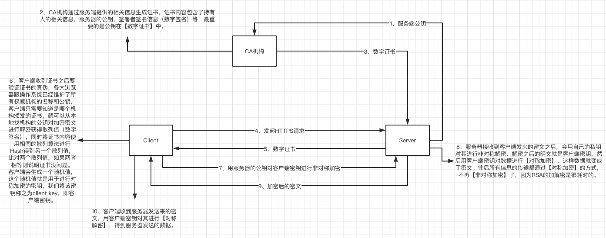
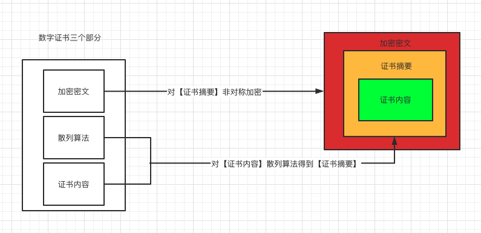
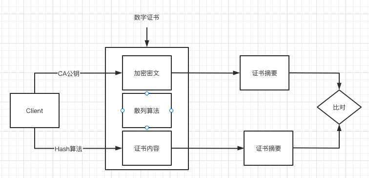

https也就是我们的一个安全的http传输协议，通过加密算法去把对应的一个内容做加密，防止不良的一个拦截以及偷窥对应的内容，它对应的一个加密策略，主要是【非对称加密运算】+【对称加密运算】。

### 对称加密

对称加密是指双方持有相同的密钥进行通信，加密速度快，但是有一个安全问题：双方怎样获得相同的密钥？
常见的对称加密算法有DES、3DES、AES等。

### 非对称加密

非对称加密，又称为公开密钥加密，是为了解决对称加密中的安全问题而诞生，一个称为【public key】，即公钥，另一个称为【private key】，即私钥。但是它的加密速度相对于对称加密来说很慢。

- 公钥(public key)是对外开放的，私钥(private key)是自己拥有的。
- 公钥(public key)加密的数据，只能用私钥(private key)解密。
- 私钥(private key)加密的数据，只能用公钥(public key)解密。

### Https协议交换过程

想要安全的获得相同的密钥，前提是要有安全的认证，需要权威的第三方公认机构来参与：CA。

一个https服务器，是需要CA认证证书的，这个证书是Server能否被Client信任的关键。

三者交换流程如下：

1. Server向CA申请【数字证书】，携带自身相关信息，重点是【公钥】。
2. CA机构通过Server提供的相关信息生成【数字证书】，一个证书中含有三个部分:"证书内容，散列算法，加密密文"，证书内容会被【散列算法】计算出hash值，然后使用CA机构提供的【私钥】进行【RSA加密】。将证书发给Server。（如下图1所示）
3. 当Client向Server发起Https请求时，Server便将【数字证书】发给Client。
4. Client收到证书之后要验证证书的真伪，各大浏览器跟操作系统已经维护了所有权威机构的名称和公钥，客户端只需要知道是哪个机构颁发的证书，就可以从本地找机构的公钥对加密密文进行解密获得散列值（数字签名），同时将证书内容使用相同的【散列算法】进行Hash得到另一个散列值，比对两个散列值，如果两者相等则说明证书没问题。（如下图2所示）
5. Client向Server发送自己所能支持的对称加密方案，供Server端进行选择。
6. Server在Client提供的加密方案中选择加密程度最高的加密方式。
7. Server将选择好的加密方案通过【明文】方式返回给Client。
8. Client使用该加密方式生成随机值，这个随机值就是用于进行【对称加密】的【密钥】，称【客户端密钥】，使用Server返回的公钥进行加密，将【加密后的随机码】发送至Server。
9. Server接收到Client发来的【加密后的随机码】之后，会用自己的私钥对其进行【非对称解密】，解密之后的明文就是【客户端密钥】，然后用【客户端密钥】对数据进行【对称加密】，这样数据就变成了【密文】。往后所有信息的传输都通过【对称加密】的方式，不再【非对称加密】了，因为RSA的加解密是很耗时的。
10. Client收到Server发送来的【密文】，用【客户端密钥】对其进行【对称解密】，得到服务器发送的数据。

​										图1-数字证书三部分

​										图2-验证证书真伪

