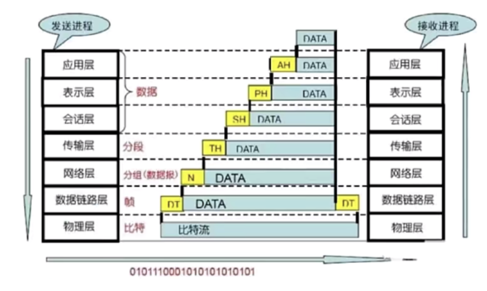

物理层：机器A往机器B发送比特流，机器B要收到比特流就是物理层要做的事，物理层主要定义了物理设备的标准，如：网线的类型、光纤的接口类型，各种传输介质的传输速率等；主要作用是传输【比特流】，即 0 1 二进制数据，将他们转换成电流强弱来传输，到达后再转化成 0 1 机器码，也就是常说的数模转换与模数转换，这层的数据叫比特，【网卡】就是在这一层。

数据链路层：在传输比特流的过程中，会产生错传，数据传输不完整的可能，数据链路层定义了如何格式化数据以进行传输，以及如何控制对物理介质的访问，这一层还提供错误检测和纠正以确保数据传输的可靠性，本层将比特数据组成了【帧】，【交换机】工作在这一层，对桢解码，并根据桢中包含的信息，把数据发送到正确的接收方；

网络层：随着网络节点的不断增加，点对点通信的时候是需要经过多个节点的，如何找到目标节点，如何选择最佳路径，便有了网络层；将网络地址翻译成物理地址，并决定如何将数据从发送方路由到接收方，网络层通过综合考虑发送优先权：网络拥塞程度、服务质量、可选路由的花费来决定网络节点A到B的最佳路径，路由器属于网络层，本层的数据叫数据包，本层我们需要关注的协议主要是 TCP/IP 协议里面的这个 IP 协议。

传输层：随着网络通信需求的进一步扩大，通信过程中，需要发送大量的数据，文件传输可能需要很长时间，网络通信的过程中会中断好多次。此时为了保证传输大量文件时的准确性，需要对发出去数据进行切分，切割为一个一个段落进行发送，其中一个段落丢失了，该怎么办？要不要重传？每个段落要按照顺序到达吗？这个便是传输层需要考虑的问题；传输层解决了主机间的数据传输，数据间的传输可以是不同网络，并且传输层解决了传输质量的问题，该层是OSI模型中最重要的一层，传输协议同时进行流量控制，或是基于接收方可接收数据快慢程度，规定适当的发送速率，除此之外，传输层按照网络能处理的最大尺寸，将较长的数据包进行数据分割，例如以太坊无法接受大于1500字节的数据包，发送方节点的传输层将数据分割成较小的数据片，并且对每一个数据片安排一个序列号，以便数据到达接收方节点的的传输层时，能以正确的顺序重组，该过程称为排序，传输层中需要我们关注的协议有 TCP/IP 中的 TCP 协议和 UDP 协议。

会话层：我们已经可以给正确的计算机发送正确封装过后的信息了，但是用户级别的体验好不好？难道我每次都要去调用 TCP 去打包，调用IP协议去找路由，自己去发？当然不行，所以我们要建立一个自动收发包，自动寻址的功能，于是有了会话层，作用就是建立和管理应用程序之间的通信。

表示层：我能保证应用程序自动收发包和寻址了，假如我要用Linux给Window发包，两个系统语法不一致，就像exe包不能在Linux允许一样，于是需要表示层，帮我们解决不同系统之间通信语法的问题。

应用层：在表示层，数据将按照网络能理解的方案进行格式化，这种格式化也因所使用网络的类型不同而不同，此时虽然发送方知道自己发送的是什么东西，转换成字节数组之后有多长，但接收方肯定不知道，所以应用层的网络协议诞生了，他规定发送方和接收方必须使用一个固定长度的消息头，消息头必须使用某种固定的组成，而且消息头里必须记录消息体的长度等一系列信息，以方便接收方能正确的解析发送方发送的数据，应用层旨在让你更方便的应用同一网络中接收到的数据；至于数据的传递没有该层，你也可以直接在两台电脑间开干，只不过传来传去，就是一堆一和零组成的字节数组，该层需要我们重点去关注的是与之相对应的TCP IP协议中的http协议。

以上就是OSI各个层次的划分，从应用层开始都会对要传输的数据头部进行处理，加上本层的一些信息，最终物理层通过以太网电缆等介质，将数据解释成比特流在网络中传输，数据传输到目标地址，并自低而上的将先前对应层的头部给解系分离出来，这个就是我们网络数据处理的整个流程。