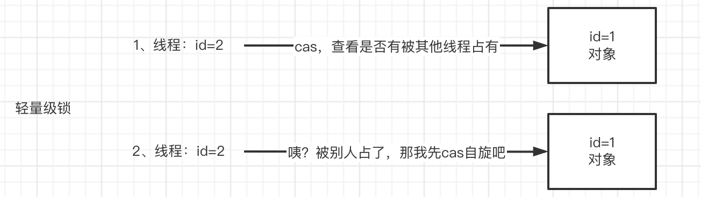

## 同步锁

### Synchronized 和 ReentrantLock

两者都可以用来同步等待的加锁动作， 在最新的 Jdk 版本当中，这两个对应的一个类或者关键字有什么区别呢？一般会觉得 synchronized 的性能不如 ReentrantLock，这个主要是因为后面会讲的三种锁所导致的，但是在最新的 Jdk 版本当中， synchronized 关键字已经可以在内部的原理上优化到和ReentrantLock相同的一个级别。性能来说已经相差无异了，两者的区别主要是：

- 关键字和非关键字：synchronized可以自动释放锁，ReentrantLock需要手动释放。
- 等待可不可以中断：synchronized没法设置超时等待时间；ReentrantLock可以通过tryAcquire方法，设置超时时间，避免锁持有不到影响程序的往下运行。
- 是否可以设置公平锁：都可以用来处理同步等待加锁的动作，默认的实现没有公平锁可言，无论我对应的线程等待时间是多少，只要在锁上发生竞争，下一个获得锁的线程是随机性的，但是ReentrantLock可以通过参数的方式来设置锁是否公平。

- 更细粒度的锁控制对象：ReentrantLock 优于 synchronized。

### 三种锁

- 重量级锁
- 轻量级锁
- 偏向锁

**偏向锁**

偏向锁顾名思义是有偏向型的，当锁对象被第一个线程竞争的时候，线程会采用CAS的操作，去比较原本的锁是否有其他线程的线程号，没有的话，锁竞争成功，代表只有自己竞争到了对应的偏向锁，并且设置上自己的线程号，如果有别的线程也使用CAS操作的话，会发现偏向锁已经被竞争掉了，偏向锁就会升级为轻量级锁。

**轻量级锁**

轻量级锁是在对应的锁上面做自旋操作：相当于在应用层的代码当中，写一个while true，不断的去CAS操作，去尝试获取锁的过程，由于没有发生用户态和内核态之间的切换，因此自旋锁的操作是轻量级的。

但是一直while true对CPU来说也是一种负担，因此一般来说轻量级锁的自旋锁的自选周期会设置一个控值，如果锁竞争的条件是很苛刻的，就不会去自旋很多次，而是自旋一定的次数后就变成重量级锁；如果可以很快的获取锁对象，那就可以尝试加大自旋的力度。

**重量级锁**

在 Jdk1.6 之前，synchronized默认只有重量级锁，重量级锁借助了操作系统的monitor机制，一旦碰到了对应的锁，就需要用户态和内核态之间的切换，去做锁竞争，因此对应的锁竞争，解锁的条件，包括唤醒的流程是非常的重量级的，跟ReentrantLock比起来性能就差多了。

在新版本中，synchronized也引进了轻量级锁跟偏向锁，性能跟ReentrantLock相近。

不管是synchronized和reentrantLock，对锁升级的操作都是遵循优先尝试偏向锁锁定，如果偏向锁发生竞争，升级为轻量级锁，去做自旋操作，并且可以根据锁是否能被快速的持有，自动的判断自旋的次数；如果达到了自旋的次数，转为切换成最重量级的monitor锁内核态的切换来获取最终的一个锁。