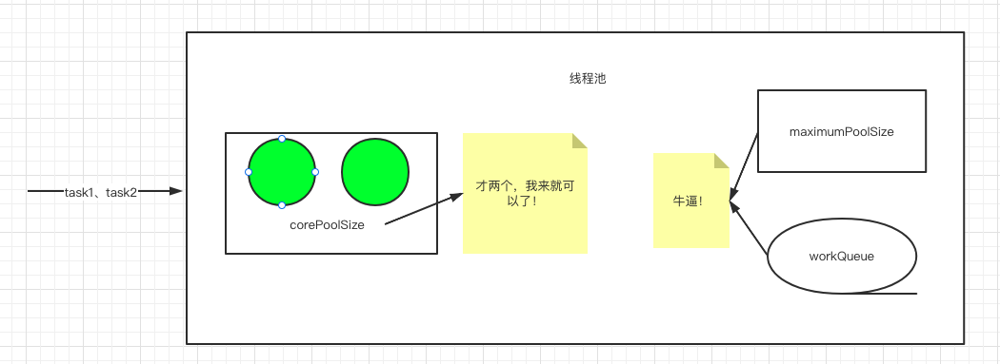
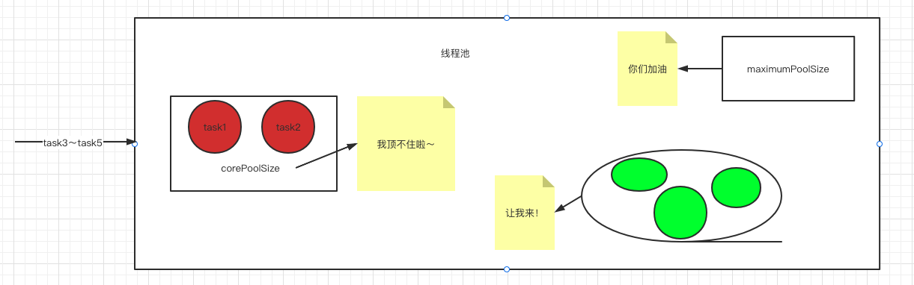
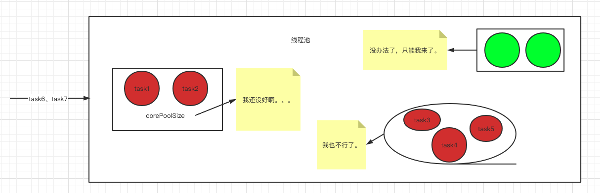
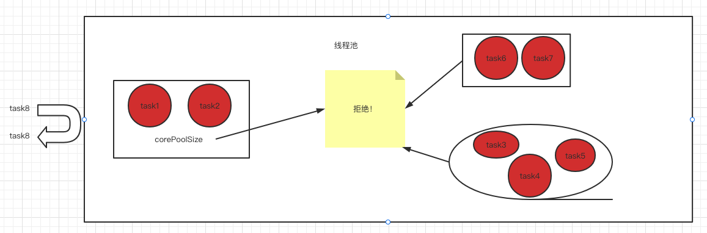

## 线程池的核心参数及结构

**ThreadPoolExecutor**：

- int corePoolSize	核心线程数
- int maximumPoolSize	最大线程数
- long keepAliveTime	空闲线程多久被销毁
- BlockingQueue workQueue	等待队列数
- RejectedExecutionHandler defaultHandler	拒绝策略
  - 丢弃	AbortPolicy
  - 丢弃抛异常	CallerRunsPolicy
  - 调用线程处理	DiscardPolicy
  - 丢弃最前面的任务然后重新尝试执行	DiscardOldestPolicy


假设我们现在构造了这么一个线程池

```java
threadPoolExecutor =  new ThreadPoolExecutor(corePoolSize:2, 
                                             maximumPoolSize:2, 
                                             keepAliveTime:1000, 
                                             TimeUnit.MICROSECONDS, 
                                             workQueue:new LinkedBlockingQueue<>(3));
```


当有任务提交进来的时候，需要运行的任务数 <= corePoolSize的时候，只需要用到corePoolSize就可以了




当大于corePoolSize之后，就需要workQueue了




当corePoolSize、workQueue都满了，这时候还有任务提交进来的话，就需要maximumPoolSize了




如果这个时候再进来corePoolSize、workQueue、maximumPoolSize都满了，这时候还有任务提交进来的话，就会执行拒绝策略




注意⚠️：这个时候线程池里只会有4个子线程在执行任务，分别是corePoolSize的2个+maximumPoolSize的2个，而不是7个，workQueue里的任务不会起子线程去处理，只有等corePoolSize有空闲位置了，才会从workQueue里拿。

等不再有任务提交进来，超过核心线程数的线程执行完任务之后，就会在 keepAliveTime：1000ms 之后销毁，最后线程池里的线程数=corePoolSize。