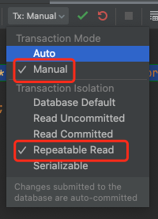
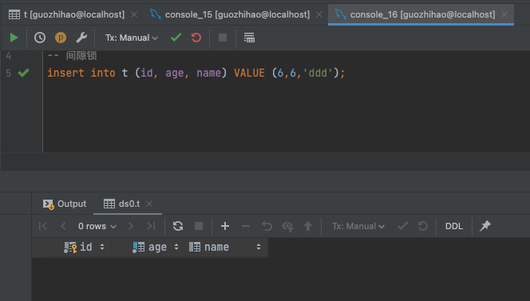
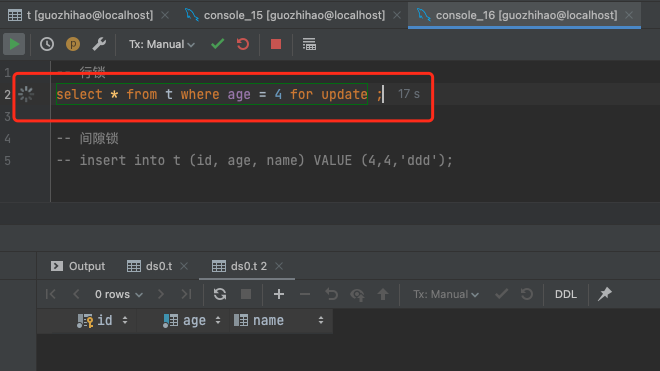
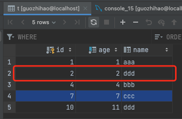

## 快照读和当前读

在mysql里，所有的读操作，默认都是【快照读】，即读的是历史版本；如果加【for update】、【lock in share mode】则是当前读。

因为mysql是通过【MVCC多版本控制】去处理事务之间的一个可见性和对应的一个副本问题，

假设现在有2个事务，在**默认情况**下，强调“默认”是因为Mysql默认的事务隔离级别是【RR——可重复读】，不同隔离级别锁的层面不一样。


1、快照读下，哪怕这个时候有别的事务修改了这条数据并提交了，不管第5步刷新多少次，我们看到的还是之前查询到的数据。

| 步骤 | 事务1                        | 事务2                                   |
| ---- | ---------------------------- | --------------------------------------- |
| 1    | begin ;                      |                                         |
| 2    | select * from t where id= 1; |                                         |
| 3    |                              | update t set name = 'gzh' where id = 1; |
| 4    |                              | commit;                                 |
| 5    | select * from t where id= 1; |                                         |


2、当前读下，哪怕这个时候有别的事务修改了这条数据并提交了，我们看到的就是最新的数据。

| 步骤 | 事务1                                   | 事务2                                   |
| ---- | --------------------------------------- | --------------------------------------- |
| 1    | begin ;                                 |                                         |
| 2    | select * from t where id= 1;            |                                         |
| 3    |                                         | update t set name = 'gzh' where id = 1; |
| 4    |                                         | commit;                                 |
| 5    | select * from t where id= 1 for update; |                                         |


3、当前读下，事务1迟迟没有提交，那这条数据会阻塞，因为当前读会加排它锁。

| 步骤 | 事务1                                   | 事务2                                   |
| ---- | --------------------------------------- | --------------------------------------- |
| 1    | begin ;                                 |                                         |
| 2    | select * from t where id= 1 for update; |                                         |
| 3    |                                         | update t set name = 'gzh' where id = 1; |


提交之后，不再阻塞。


⚠️：第一种【快照读】的情况，只发生：事务1快照读——事务2更新——事务1快照读；如果是：事务2更新——事务1快照读，这个时候事务1执行【快照读】看到的是最新数据。


## 当前读的锁机制

主要分为：

- 行锁
- 表锁
- 间隙锁


【行锁】是最细粒度的锁，一般当我们【当前读】操作的是【主键】，锁只会影响到对应的行；

如果【当前读】操作的是【普通索引】，比如 where c = 20，那就会对 c = 20 的那两行加锁；

如果【当前读】作用的是无索引的字段，哪怕指明 where d = 5，但是他没有办法从索引的级别去控制锁的粒度，锁就会降级成【表锁】。

 【间隙锁】往往发生在一个事务对【索引】做【当前读】操作，还没【commit】，另一个事务就对【索引】做【插入】操作，从而加了一个区间范围内的锁，这个区间范围的锁就叫【间隙锁】。


## 锁实例演示

新建表

```sql
-- auto-generated definition
create table t
(
    id   int auto_increment comment '主键'
        primary key,
    age  int        not null comment '年龄',
    name varchar(8) null comment '名称'
)
    charset = utf8;

create index index_age
    on t (age);
```


【数据】跟【索引信息】如下所示：


| ID主键 | Age（普通索引） | Name（无索引） |
| ------ | --------------- | -------------- |
| 1      | 1               | aaa            |
| 4      | 4               | bbb            |
| 7      | 7               | ccc            |


禁用【自动提交】，在Mysql默认的【RR】级别下操作：




### 【主键】+【行锁】

事务1等值当前读主键存在的数据，事务2等值查询主键不存在的数据

| 步骤 | 事务1                                     | 事务2                                     |
| ---- | ----------------------------------------- | ----------------------------------------- |
| 1    | begin ;                                   |                                           |
| 2    | select * from t where id = 4 for update ; |                                           |
| 3    |                                           | select * from t where id = 5 for update ; |
| 4    | commit ;                                  |                                           |
| 5    |                                           | commit ;                                  |


结论：不阻塞，两个事务加的不同的【行锁】，互不影响。

但是，如果两个事务加的是同一个【行锁】，就会阻塞。

| 步骤 | 事务1                                     | 事务2                                     |
| ---- | ----------------------------------------- | ----------------------------------------- |
| 1    | begin ;                                   |                                           |
| 2    | select * from t where id = 4 for update ; |                                           |
| 3    |                                           | select * from t where id = 4 for update ; |
| 4    | commit ;                                  |                                           |
| 5    |                                           | commit ;                                  |


### 【主键】+【间隙锁】

事务1等值当前读主键存在的数据，事务2插入id为6的新数据

| 步骤 | 事务1                                     | 事务2                                            |
| ---- | ----------------------------------------- | ------------------------------------------------ |
| 1    | begin ;                                   |                                                  |
| 2    | select * from t where id = 4 for update ; |                                                  |
| 3    |                                           | insert into t (id, age, name) VALUE (6,6,'ddd'); |
| 4    | commit ;                                  |                                                  |
| 5    |                                           | commit ;                                         |



插入操作没有阻塞，提交之后，新数据新增成功


结论：【主键】在数据存在的情况下，不会产生【间隙锁】，只会【行锁】，所以insert不影响。

但是，如果【主键】对不存在的数据做【当前读】，比如 id = 5 的数据不存在，则会产生 [4,7] 的【间隙锁】。删掉 id = 6的数据测试

| 步骤 | 事务1                                     | 事务2                                            |
| ---- | ----------------------------------------- | ------------------------------------------------ |
| 1    | begin ;                                   |                                                  |
| 2    | select * from t where id = 5 for update ; |                                                  |
| 3    |                                           | insert into t (id, age, name) VALUE (6,6,'ddd'); |
| 4    | commit ;                                  |                                                  |
|      |                                           | commit ;                                         |


结论：因为【间隙锁】，所以阻塞了。

验证区间准确性，对区间以外的数据做新增，新增成功说明区间正确。

| 步骤 | 事务1                                     | 事务2                                            |
| ---- | ----------------------------------------- | ------------------------------------------------ |
| 1    | begin ;                                   |                                                  |
| 2    | select * from t where id = 5 for update ; |                                                  |
| 3    |                                           | insert into t (id, age, name) VALUE (2,2,'ddd'); |
| 4    | commit ;                                  |                                                  |
| 5    |                                           | commit ;                                         |


### 【普通索引】+【行锁】

事务1等值当前读主键存在的数据，事务2等值查询主键不存在的数据

| 步骤 | 事务1                                      | 事务2                                      |
| ---- | ------------------------------------------ | ------------------------------------------ |
| 1    | begin ;                                    |                                            |
| 2    | select * from t where age = 4 for update ; |                                            |
| 3    |                                            | select * from t where age = 5 for update ; |
| 4    | commit ;                                   |                                            |
| 5    |                                            | commit ;                                   |


结论：不阻塞，说明【普通索引】下两个事务加的不同的【行锁】，互不影响。

但是，如果两个事务加的是同一个【行锁】，就会阻塞。

| 步骤 | 事务1                                      | 事务2                                      |
| ---- | ------------------------------------------ | ------------------------------------------ |
| 1    | begin ;                                    |                                            |
| 2    | select * from t where age = 4 for update ; |                                            |
| 3    |                                            | select * from t where age = 4 for update ; |
| 4    | commit ;                                   |                                            |
| 5    |                                            | commit ;                                   |




### 【普通索引】+【间隙锁】

事务1等值当前读主键存在的数据，事务2插入id为6的新数据

| 步骤 | 事务1                                      | 事务2                                            |
| ---- | ------------------------------------------ | ------------------------------------------------ |
| 1    | begin ;                                    |                                                  |
| 2    | select * from t where age = 4 for update ; |                                                  |
| 3    |                                            | insert into t (id, age, name) VALUE (6,6,'ddd'); |
| 4    | commit ;                                   |                                                  |
| 5    |                                            | commit ;                                         |


跟【主键】+【间隙锁】不一样，这里阻塞了。可见当我们对【普通索引】的age = 4【当前读】时，产生 (4,7] 区间的【间隙锁】，那对上区间（1,4] 会有【间隙锁】吗？测试也是会的。


为了验证只会对上下区间有影响，我们新增区间


| 步骤 | 事务1                                      | 事务2                                            |
| ---- | ------------------------------------------ | ------------------------------------------------ |
| 1    | begin ;                                    |                                                  |
| 2    | select * from t where age = 4 for update ; |                                                  |
| 3    |                                            | insert into t (id, age, name) VALUE (9,9,'ddd'); |
| 4    | commit ;                                   |                                                  |
| 5    |                                            | commit ;                                         |


没有阻塞，提交之后，数据也成功新增


如果【普通索引】对不存在的数据做【当前读】


不出所料，下区间 (4,7] 区间产生了【间隙锁】，那上区间（1,4] 呢？

没有阻塞，提交后，数据新增成功




结论：【普通索引】在等值【当前读】的情况下，会产生【上下两个区间】的【间隙锁】；【普通索引】在不等值【当前读】的情况下，会产生【左开右闭】区间的【间隙锁】。

【主键】只有在【当前读】命中不到的情况下，才会产生【左开右闭】区间的【间隙锁】。


之所以会有两个区间，因为【普通索引】的数据结构：叶子结点只有对应列值跟主键，因为数据文件是分离的，所以会通过主键去找对应的数据行，且值不唯一。而数据文件中的数据是按【主键】顺序排序的。

所以我们往往会采用【唯一索引】的方式去做对应的去重，这样命中了就不会产生【间隙锁】，只会是【行锁】。