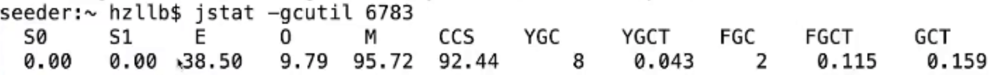

### 通用 JVM 工具

**jps：虚拟机进程状态工具**

实例：jps -v | grep pid

**jinfo：jvm参数信息工具**

实例：jinfo -flags pid

**jstat：查看虚拟机各种运算状态**

实例：jstat -gcutil pid

S0：新生代Survivor space 0区已使用空间的百分比

S1：新生代Survivor space 1区已使用空间的百分比

E：新生代已使用空间的百分比

O：老年代已使用空间的百分比

M：元数据区已使空间的百分比

CCS：压缩类空间利用率百分比

YGC：从应用程序启动到当前发生Young GC的次数

YGCT：从应用程序启动到当前发生Young GC所用的时间【单位秒】

FGC：从应用程序启动到当前发生Full GC的次数

FGCT：从应用程序启动到当前发生Full GC所用的时间【单位秒】

GCT：从应用程序启动到当前发生用于垃圾回收的总时间【单位秒】

**jstack：线程快照工具**

实例：jstack -l pid

**jmap：HeapDump工具**

实例：

jmap -heap pid 查看堆信息

jmap -dump:format=b,file=heapDump.hprof pid 导出堆文件并用jhat查看

jhat -port 8899 heapDump.hprof

浏览器访问：http://ip:8899

**线上OOM排查**

一般OOM发生之后我们很难再去排查，所以我们可以在程序启动的时候加 

-XX:+HeapDumpOnOutOfMemoryError，然后把heapdump.hprof文件存到-XX:+HeapDumpPath目录下。

实例：java -Xms48m -Xmx48m 

-XX:+HeapDumpOnOutOfMemoryError -XX:+HeapDumpPath=./heapdump.hprof -jar xx.jar

然后使用jprofiler查看dump文件及call tree分析