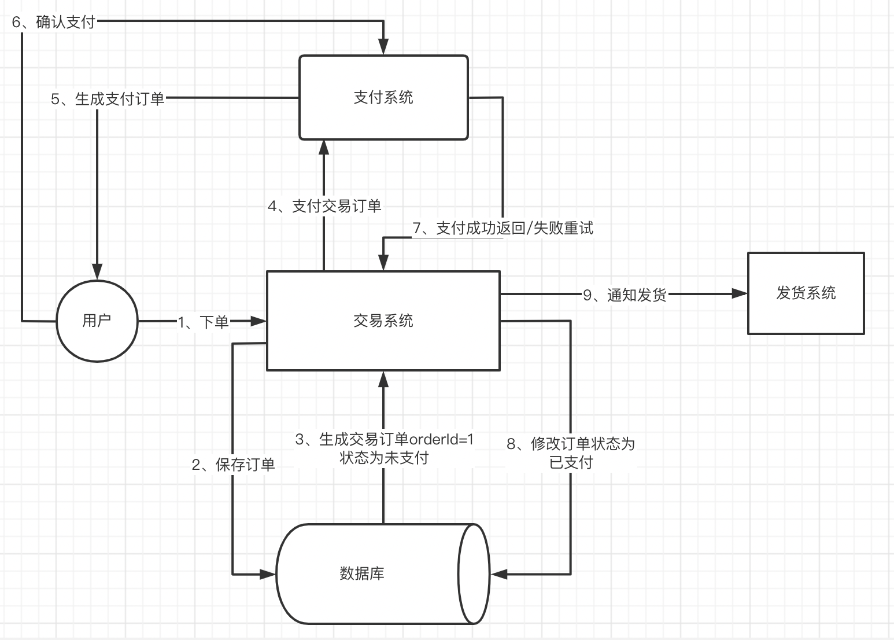
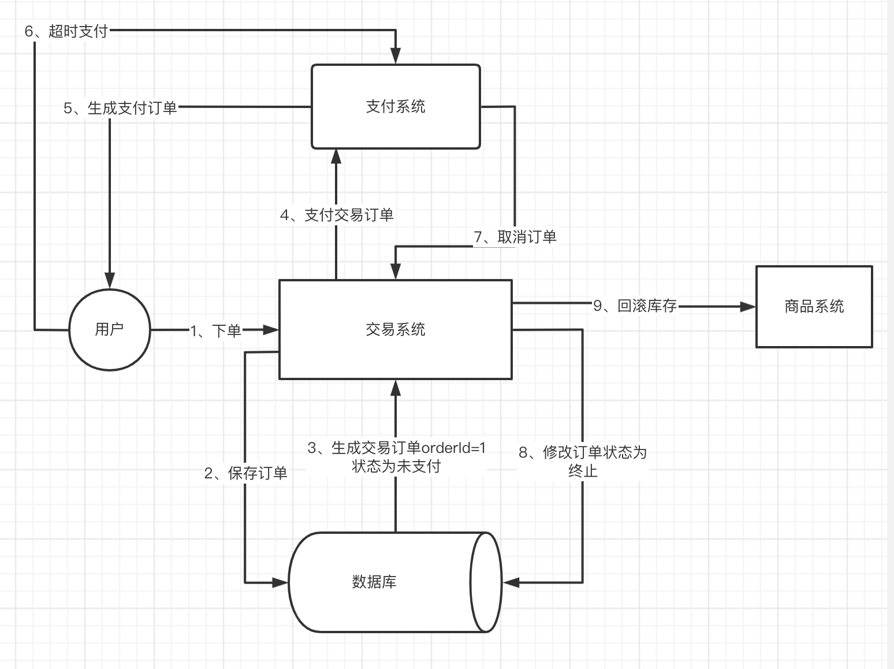

## 交易一致性问题

- 重复支付

- 超时退问题

## 重复支付

如上图所示，用户支付成功之后，【支付系统】是要告诉【交易系统】orderId=1的这条交易订单已经支付完成了，这期间因为网络或者某些原因，如果第7点失败了，那就会重试，有可能导致发了两次货。

对应的伪代码操作如下：

1. select * from order_info where id = '20220101';
2. java代码判断 status == '未支付' ，执行第3步，否则返回;
3. update order_info set status = '已支付' where id = '20220101'，并且发货;

以上代码没有加锁的操作，如果短时间内重试，是有可能3步都执行成功的。

通过数据库层面加锁进行防重：

悲观锁

1. select * from order_info where id = '20220101' **for update**;
2. java代码判断 status == '未支付' ，执行第3步，否则返回;
3. update order_info set status = '已支付' where id = '20220101'，并且发货;

for update就是做当前读的操作，并且把这条记录锁住，加一把行锁；只有这个事务提交了，id = '20220101' 才能被其他事务访问，这时已经是status = '已支付'，然后只能返回。

乐观锁

1. select * from order_info where id = '20220101' ;
2. java代码判断 status == '未支付' ，执行第3步，否则返回;
3. update order_info set status = '已支付' where id = '20220101' **and  status = '未支付'**，判断影响行数，若为1，则发货；若为0，则不发货;

两种方法，乐观锁优于悲观锁，因为悲观锁会block整个事务，但是乐观锁只会block第3步。

## 超时退

订单支付都会有时效性，平常我们下单最少都会有10分钟的支付期限，如果超过了时间还没支付，就需要对生成订单之前的所有操作做回滚，这里简单例举【回滚库存】，当然实际场景中还会涉及到优惠券等等。面对超时退问题，我们需要了解：

- 如何回滚内容？
- 回滚失败如何解决？一般是重试。
- 重试要预防重复回滚。

因为【交易系统】跟【商品系统】分属两个不同的事务，想要解决这个问题就涉及到分布式事务。

首先了解分布式事务原理——CAP：

在一个分布式系统中，一致性（Consistency）、可用性（Availability）、分区容错性（Partition tolerance）。CAP 原则指的是，这三个要素最多只能同时实现两点，不可能三者兼顾。分区容错性是肯定要实现的，不然就不是分布式系统，于是乎就是在【CP】跟【AP】之间做取舍。

一般为了提高吞吐，都会选择【AP】，从而牺牲掉【CP】，【AP】属于【弱一致性】。

基于【AP】，我们有了BASE原理：

- Basically Available（基本可用）

- Soft state（软状态）

- Eventually consistent（最终一致性）

BASE原理首先追求的是基本可用，我们需要确保整个分布式系统在互联网的场景中是可用的状态，而不能让他完全不可用；这需要记录一个软状态，为了保证基本可用，是需要牺牲强一致性的，对应的在某一个系统的某一个时刻，就会出现不同分区的状态是不完全一致的，比如B分区的状态可能是最终的状态，A分区的状态由于要保证基本可用，还没办法达到最终的状态，于是当前处于的就是软状态，一般我们的分布式系统中都会引入一种“处理中“的【软状态】；虽然在我们的CAP理论当中，我们没有办法保证对应的一个【强一致性】，只能借助【软状态】，保证一个【弱一致性】的基本可用，但是我们一定要在分布式系统当中有一套机制可以保证住对应【最终一次性】，使得他们在某一个时间点可以保证一致，那这个就是BASE理论当中的一个【最终一次性】。

那么有什么机制呢？常见的分布式事务方案有以下：

- 二阶段提交
- TCC协议
- RAFT同步
- 异步确保型
- 事务型消息