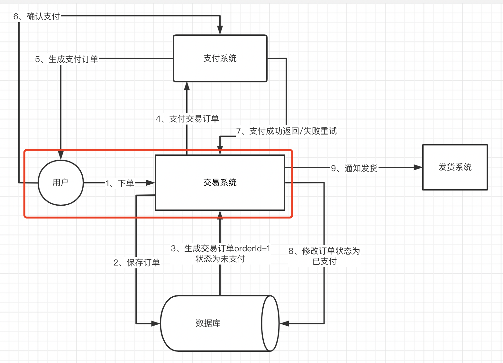
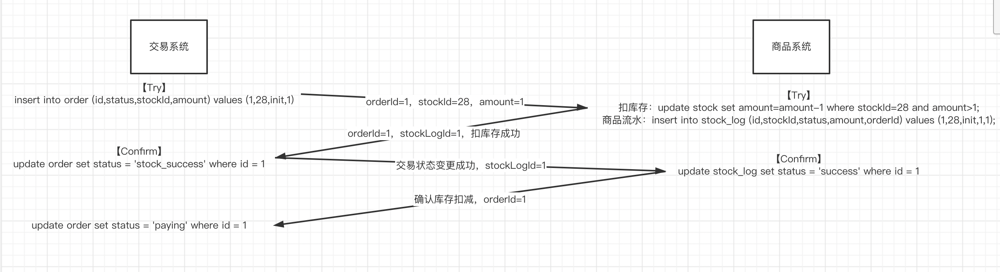
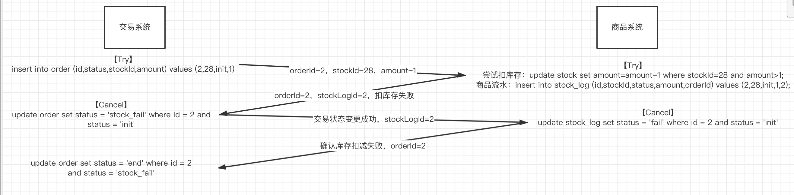

分布式事务方案：

- 二阶段提交
- **TCC协议**
- 异步确保型
- 事务型消息

## TCC

无论是【二阶段提交协议】还是改良的【Raft协议】，在整个数据层面，由于分布式锁的存在，都是需要在整个应用的执行过程当中进行多写；在多写的过程当中，由于事务锁这样的机制是很难满足高并发场景下高可用的需求，因此应运而生了【TCC协议】。

TCC有类似于【二阶段提交协议】的三个关键词，分别是第一阶段【try】、第二阶段的【confirm】以及任何一个地方失败之后的【cancel】。三个关键词对应【二阶段提交协议】的【prepare】、【commit】、【rollback】，整个TCC协议就是仿照了【二阶段提交协议】在应用层面抽象对应的【try】、【confirm】、【cancel】。

在任何的一个【try】、【confirm】、【cancel】阶段当中都可以去执行一个完整的本地事务，整个【TCC协议】相较于【二阶段提交协议】，无需锁定资源在整个【二阶段提交协议】的时间范畴内，而仅仅只需要锁定资源在对应的try事务、confirm事务、cancel事务当中，因此【TCC协议】被广泛的用于对应的应用层的分布式事务实现，用来取代【二阶段提交协议】。

接下来我们根据之前的流程对红色这块业务以TCC协议的方案进行开发：用户能否成功下单取决【商品系统】能否成功扣减。

成功如下：

失败如下：

这样会有个问题，就是请求丢失的情况，针对这种情况，我们可以通过定时器扫描每种订单状态，处理超时还没更改状态的订单，按照【TCC协议】方案往下走。