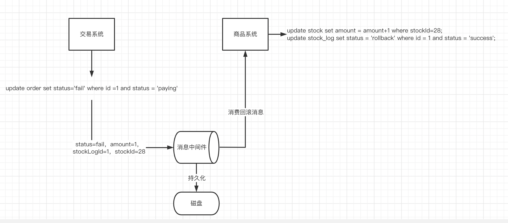
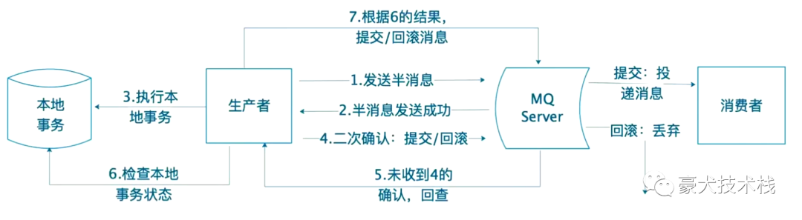

分布式事务方案：

- 二阶段提交
- TCC协议
- 异步确保型
- **事务型消息**

## 事务型消息

最后的一种分布式事务方案是事务型消息，主要是用来确保发送方的一个落地能力；

从之前的 【 [异步确保型](./分布式事务方案：异步确保型.md) 】我们可以发现，虽然消息投递到消息队列了，但是【交易系统】还没commit就突然宕机了，那当【商品系统】消费这条消息之后，两边的数据就不一致了。又或者【交易系统】执行本地事务成功，也成功提交到【消息队列】，但是消费端没有取消自动提交，【商品系统】消费之后，准备commit时也宕机了，那也会导致两个数据不一致。

解决这个问题可以采用【RocketMQ】作为消息队列，工作流程如下：

主要是引入了【半消息】这么一个软状态，【半消息】存在于MQ Server，标记了【半消息】的消息暂时不能投递，即不会被消费者消费到。只有等生产者本地事务执行成功了，该消息才能被消费。就算生产者宕机了，经过一段时间之后，MQ Server发现一条半消息好久没有commit或者rollback，会向生产者回查消息，去获得本地事务的执行状态，根据事务决定消息要不要投递。

具体实现方式可以查看我之前写的一篇文章：[RocketMQ实现分布式事务](https://mp.weixin.qq.com/s?__biz=Mzg4MzAyOTE5Ng==&amp;mid=2247484312&amp;idx=1&amp;sn=64111d419234376058320c02a1ab17d3&amp;chksm=cf4ce63bf83b6f2db958c670935844b2e42513a22c4bceb5ae33d54310f28e8afe261be0b713&token=875366094&lang=zh_CN#rd)。

