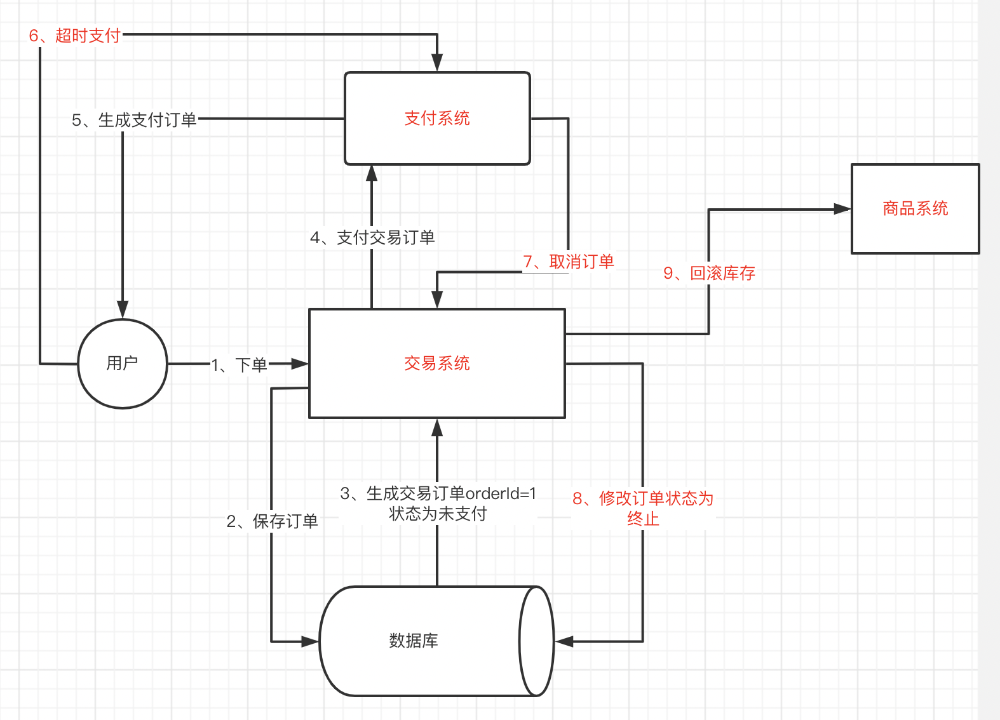

分布式事务方案：

- 二阶段提交
- TCC协议
- **异步确保型**
- 事务型消息

## 异步确保型

二阶段提交保证了强一致，牺牲了可用性，于是引入了对应的应用层二阶段提交——TCC协议，但本质上来说，仍然保证的是最终一致性，而非强一致。第三种对应的一个异步确保型，也是以牺牲强一致来保证可用性的，其方案的处理方式，其本质上来说是采用异步消息的方式。

以这个场景为例：如果商品扣减成功，但是支付失败，那我们需要对扣减的商品进行回滚。

实现方案如下：

异步就是借助中间件的方式，用什么消息队列实现无所谓，重要的是要做好三个保障：

- 【交易系统】生产者要确保消息成功投递到消息队列中。
- 消息队列的数据要持久化。
- 【商品系统】消费者要做好消息幂等。